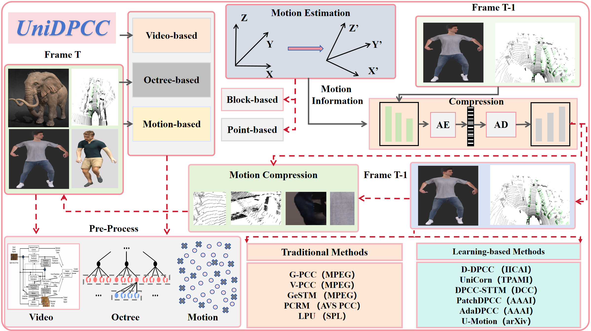
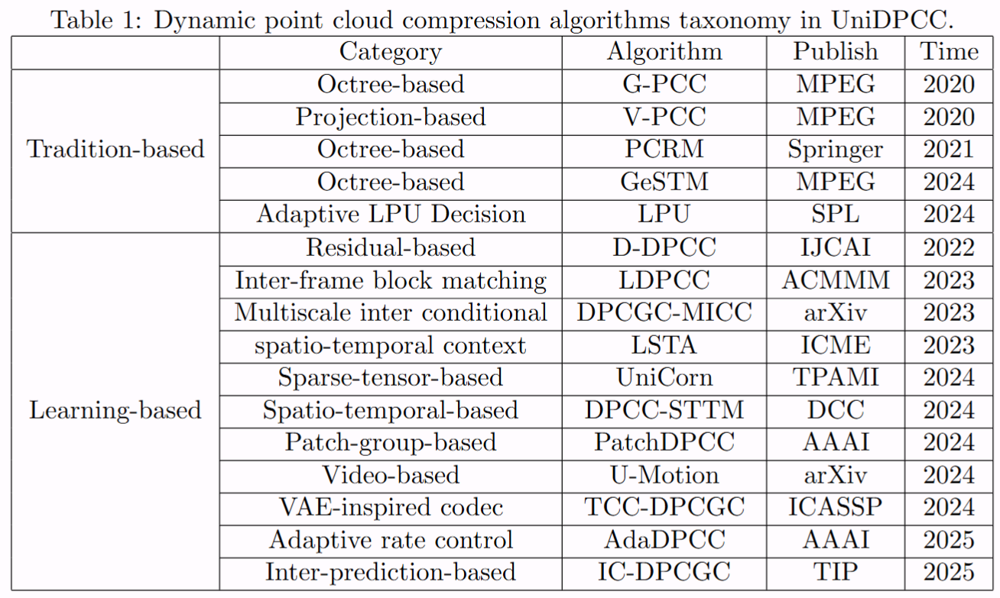
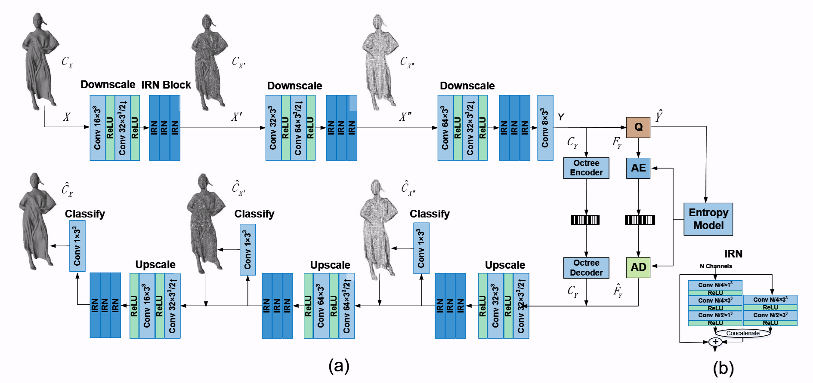
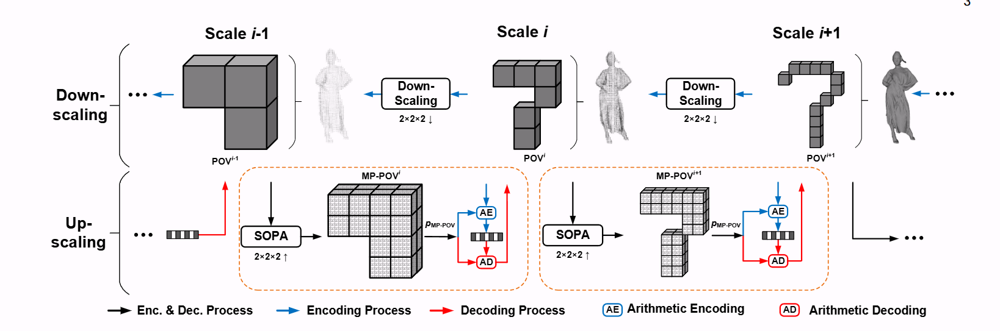
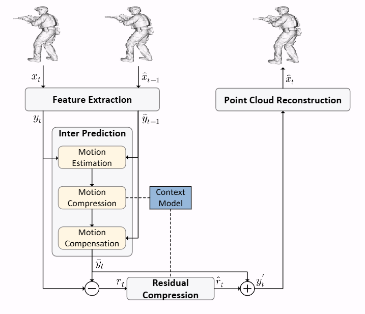
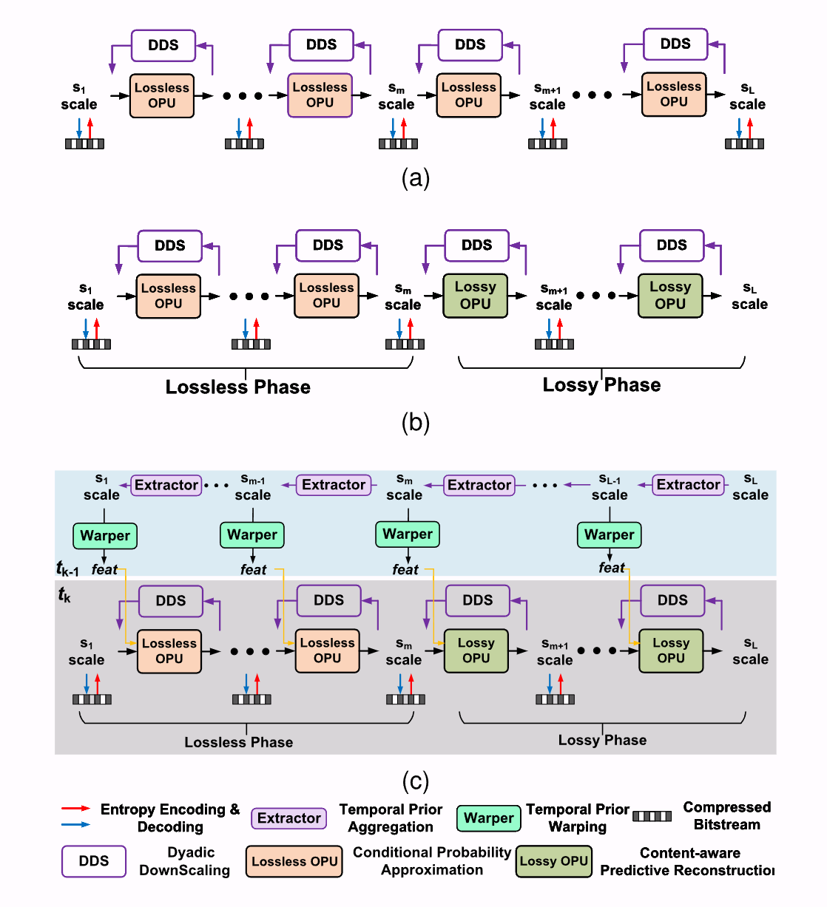
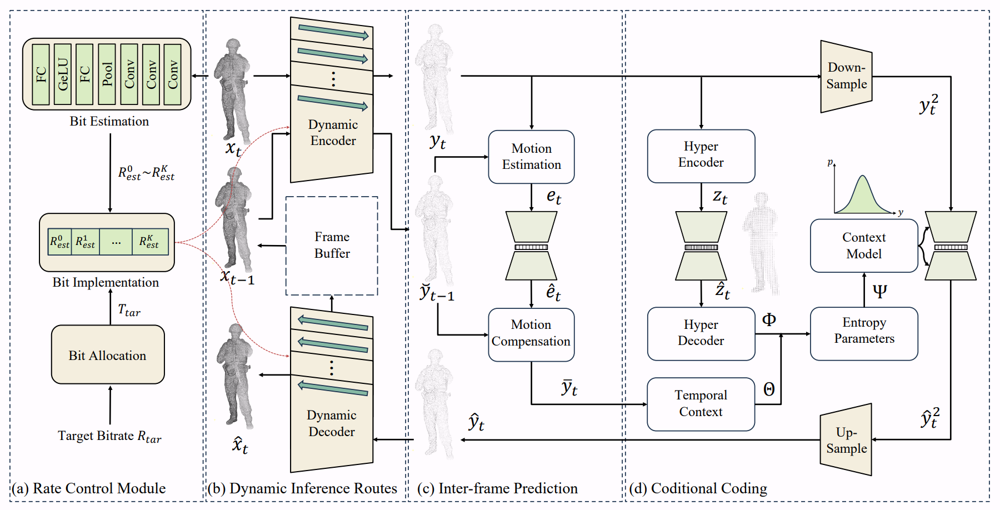
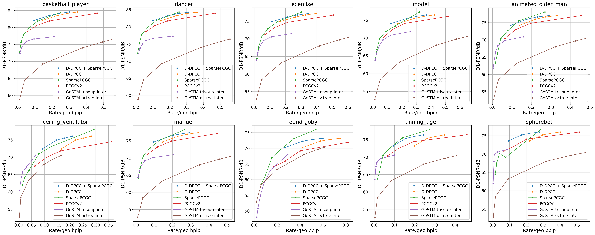

# UniDPCC: Towards Practical Dynamic Point Cloud Compression via An Unified Framework

#### We appreciate any useful suggestions for improvement of this paper from peers. Please raise issues. Thanks for your cooperation!

Training Dataset：
链接: https://pan.baidu.com/s/1p35k6eEGyvWZsYwJoO2WIQ?pwd=5t9i 提取码: 5t9i

Testing Datase:
https://pan.baidu.com/s/1JhiVj2kqEwi7aoMkl-_RcQ?pwd=8kmn 提取码: 8kmn

# Motivation

Current research on dynamic point clouds faces significant challenges due to the scarcity of available datasets, particularly for international standards such as MPEG and AVS Point Cloud Compression (PCC), which suffer from insufficient sample numbers and limited scene diversity. To address this critical issue, this study constructs a open-source dynamic point cloud dataset specifically designed for AI-PCC applications. The dataset comprises 18 3D objects, provides high-frame-rate sequences at 200 FPS, and supports multiple quantization bit depths (10–12 bits). With its rich scene complexity and fine-grained details, the dataset comprehensively meets the requirements for dynamic point cloud compression. The data collection process leverages open-source 3D model platforms such as Sketchfab, where freely usable Mesh models is carefully selected through rigorous comparison and filtering. During data processing, tools including Blender, MeshLab, and CloudCompare is employed for model loading, sampling, and preprocessing. The final standardized point cloud sequences is generated through quantization and normal vector extraction. Experiment results demonstrate that the BD-PSNR compression performance from our dataset effectively reflect algorithm characteristics, validating its importance in dynamic point cloud compression research. Furthermore, we introduce a comprehensive dynamic point cloud compression algorithm library to facilitate performance benchmarking and comparative analysis for future research.

 

 

Dynamic Point Cloud Compression Library：

1、PCGCv2

Recent years have witnessed the growth of point cloud based applications because of its realistic and fine-grained representation of 3D objects and scenes. However, it is a challenging problem to compress sparse, unstructured, and high-precision 3D points for efficient communication. In this paper, leveraging the sparsity nature of point cloud, we propose a multiscale end-to-end learning framework which hierarchically reconstructs the 3D Point Cloud Geometry (PCG) via progressive re-sampling. The framework is developed on top of a sparse convolution based autoencoder for point cloud compression and reconstruction. For the input PCG which has only the binary occupancy attribute, our framework translates it to a downscaled point cloud at the bottleneck layer which possesses both geometry and associated feature attributes. Then, the geometric occupancy is losslessly compressed using an octree codec and the feature attributes are lossy compressed using a learned probabilistic context model.Compared to state-of-the-art Video-based Point Cloud Compression (V-PCC) and Geometry-based PCC (G-PCC) schemes standardized by the Moving Picture Experts Group (MPEG), our method achieves more than 40% and 70% BD-Rate (Bjøntegaard Delta Rate) reduction, respectively. Its encoding runtime is comparable to that of G-PCC, which is only 1.5% of V-PCC.

 

2、SparsePCGC

This study develops a unified Point Cloud Geometry (PCG) compression method through the processing of multiscale sparse tensor-based voxelized PCG. We call this compression method SparsePCGC. The proposed SparsePCGC is a low complexity solution because it only performs the convolutions on sparsely-distributed Most-Probable Positively-Occupied Voxels (MP-POV). The multiscale representation also allows us to compress scale-wise MP-POVs by exploiting cross-scale and same-scale correlations
extensively and flexibly. The overall compression efficiency highly depends on the accuracy of estimated occupancy probability for each MP-POV. Thus, we first design the Sparse Convolution-based Neural Network (SparseCNN) which stacks sparse convolutions and voxel sampling to best characterize and embed spatial correlations. We then develop the SparseCNN-based Occupancy Probability Approximation (SOPA) model to estimate the occupancy probability either in a single-stage manner only using the
cross-scale correlation, or in a multi-stage manner by exploiting stage-wise correlation among same-scale neighbors. Besides, we also suggest the SparseCNN based Local Neighborhood Embedding (SLNE) to aggregate local variations as spatial priors in feature attribute to improve the SOPA. Our unified approach not only shows state-of-the-art performance in both lossless and lossy compression modes across a variety of datasets including the dense object PCGs (8iVFB, Owlii, MUVB) and sparse LiDAR PCGs (KITTI, Ford) when compared with standardized MPEG G-PCC and other prevalent learning-based schemes, but also has low complexity which is attractive to practical applications.

 

3、D-PCC

The non-uniformly distributed nature of the 3D dynamic point cloud (DPC) brings significant challenges to its high-efficient inter-frame compression. This paper proposes a novel 3D sparse convolutionbased Deep Dynamic Point Cloud Compression (D-DPCC) network to compensate and compress the DPC geometry with 3D motion estimation and motion compensation in the feature space. In the proposed D-DPCC network, we design a Multiscale Motion Fusion (MMF) module to accurately estimate the 3D optical flow between the feature representations of adjacent point cloud frames. Specifically, we utilize a 3D sparse convolutionbased encoder to obtain the latent representation for motion estimation in the feature space and introduce the proposed MMF module for fused 3D motion embedding. Besides, for motion compensation, we propose a 3D Adaptively Weighted Interpolation (3DAWI) algorithm with a penalty coefficient to adaptively decrease the impact of distant
neighbors. We compress the motion embedding and the residual with a lossy autoencoder-based network. To our knowledge, this paper is the first work proposing an end-to-end deep dynamic point cloud compression framework. The experimental result shows that the proposed D-DPCC framework achieves an average 76% BD-Rate (Bjontegaard Delta Rate) gains against state-of-the-art Videobased Point Cloud Compression (V-PCC) v13 in inter mode.

 

4、unicorn
universal multiscale conditional coding framework,Unicorn, is proposed to compress the geometry and attribute of any given point cloud. Geometry compression is addressed in Part I of this paper, while attribute compression is discussed in Part II. We construct the multiscale sparse tensors of each voxelized point cloud frame and properly leverage lower-scale priors in the current and (previously processed) temporal reference frames to improve the conditional probability approximation or content-aware predictive reconstruction of geometry occupancy in compression. Unicorn is a versatile, learning-based solution capable of compressing static and dynamic point clouds with diverse source characteristics in both lossy and lossless modes. Following the same evaluation criteria,Unicorn significantly outperforms standard-compliant approaches like MPEG G-PCC, V-PCC, and other learning-based solutions, yielding state-of-the-art compression efficiency while presenting affordable complexity for practical implementations.

 

5、AdaDPCC

Dynamic point cloud compression (DPCC) is crucial in applications like autonomous driving and AR/VR. Current compression methods face challenges with complexity management and rate control. This paper introduces a novel dynamic coding framework that supports variable bitrate and computational complexities. Our approach includes a slimmable framework with multiple coding routes, allowing for effcient Rate-Distortion-Complexity Optimization (RDCO) within a single model. To address data sparsity in inter-frame prediction, we propose the coarse-to-fne motion estimation and compensation module that deconstructs geometric information while expanding the perceptive feld. Additionally, we propose a precise rate control module that content-adaptively navigates point cloud frames through various coding routes to meet target bitrates. The experimental results demonstrate that our approach reduces the average BD-Rate by 5.81% and improves the BD-PSNR by 0.42 dcompared to the stateof-the-art method, while keeping the average bitrate error at 0.40%. Moreover, the average coding time is reduced by up to 44.6% compared to D-DPCC, underscoring its effciency in real-time and bitrate-constrained DPCC scenarios

 

# Experimental result

As shown in the following, our experiment evaluation of geometry lossy compression algorithms yields several important findings. Across different point cloud datasets, we observe distinct performance rankings in terms of D1 PSNR metrics. On the Owlii dataset, the methods rank as follows: D-DPCC+SparsePCGC demonstrates superior performance, followed by SparsePCGC, D-DPCC, PCGCv2, GeSTM-trisoup-inter, and GeSTM-octree-inter method. However, on our proposed dataset, the performance hierarchy shifts slightly, with SparsePCGC achieving the best results, followed by D-DPCC+SparsePCGC, D-DPCC, PCGCv2, GeSTM-trisoup-inter, and GeSTM-octree-inter method. The results clearly indicate that learning-based approaches, particularly SparsePCGC and D-DPCC, consistently outperform traditional non-learning based methods such as PCGCv2 and GeSTM variants. This performance advantage is observed for both D1 and D2 PSNR metrics, where the relative rankings remain largely consistent.

 

 

